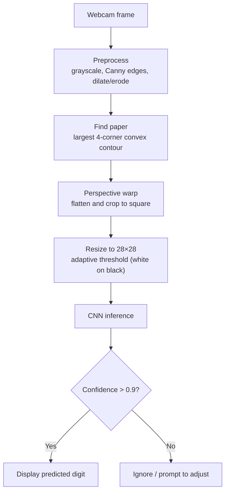

# Number Detector

Real-time handwritten-digit recognition from a webcam. The app finds a piece of paper in the camera feed, flattens it to a clean top-down image, and runs it through a convolutional neural network (trained on MNIST) to read the digit (0–9) written on it.

## Tech stack

- **Python**
- **OpenCV** — camera capture, edge detection, contour finding, perspective warp, thresholding
- **PyTorch** — CNN definition, training, and inference
- **torchvision** — MNIST dataset and image transforms
- **NumPy**

## How it works

Every frame is transformed step by step from a raw camera image into a normalized 28×28 tensor the network can classify:



Paper detection (`utils.py`) filters contours by area, four-corner convexity, and aspect ratio so it locks onto a sheet of paper rather than background clutter, then reorders the corners (TL, TR, BL, BR) before warping.

## Model

A compact CNN (`train_model.py`) trained on MNIST:

`Conv(1→32) → ReLU → Conv(32→64) → ReLU → MaxPool → Dropout → Flatten → FC(9216→128) → ReLU → Dropout → FC(128→10) → LogSoftmax`

- **Convolutional layers** extract features — edges and strokes early, loops and intersections deeper in.
- **ReLU** adds the non-linearity that lets the network learn non-trivial mappings.
- **Max pooling** down-samples, keeping the strongest activations and adding translation tolerance.
- **Dropout** (25% / 50%) randomly disables neurons during training to curb overfitting.
- **Fully connected layers** map the extracted features to the ten digit classes.

Trained with Adadelta over 5 epochs (batch size 64) on CPU.

## Project structure

| File | Role |
|---|---|
| `main.py` | Webcam loop: detect paper, warp, classify, draw the prediction |
| `utils.py` | OpenCV image processing (preprocess, find paper, perspective warp) |
| `train_model.py` | CNN definition and MNIST training; saves `model.pth` |
| `model.pth` | Pre-trained weights (included) |
| `requirements.txt` | Dependencies |

## Setup & usage

**1. Clone**
```bash
git clone https://github.com/Scooter1946/cv-number-detector.git
cd cv-number-detector
```

**2. Install dependencies**
```bash
python -m venv venv
source venv/bin/activate        # Windows: venv\Scripts\activate
pip install -r requirements.txt
```

**3. (Optional) Retrain the model** — a trained `model.pth` is already included:
```bash
python train_model.py
```

**4. Run**
```bash
python main.py
```
Hold a digit written on paper up to the camera. A prediction is shown only when the model is more than 90% confident.
